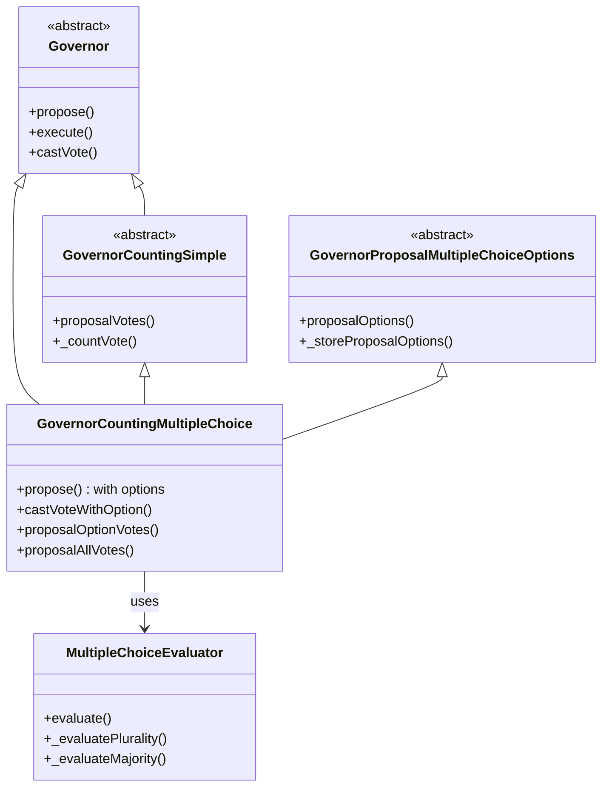
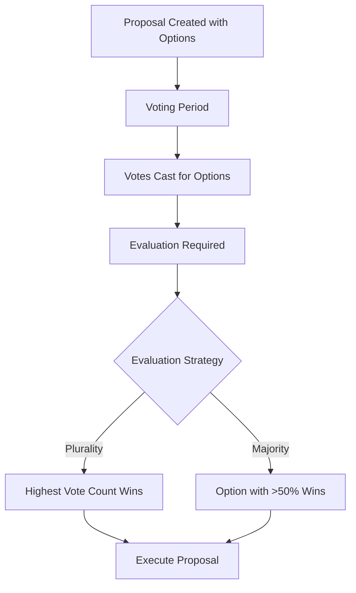

# Governor Multiple Choice

A multiple choice voting extension for OpenZeppelin's Governor contract, enabling DAOs to conduct advanced voting with flexible evaluation strategies.

## Overview

Governor Multiple Choice extends the standard OpenZeppelin Governor framework to support proposals with multiple options beyond the typical "For/Against/Abstain" voting pattern. This implementation allows governance participants to:

- Create proposals with up to 10 distinct options
- Vote for specific options rather than just approval/rejection
- Evaluate results using different strategies (Plurality or Majority)
- Maintain compatibility with all standard Governor features

## Quickstart

Here's how to quickly get started with Governor Multiple Choice:

```bash
# Install the project
git clone https://github.com/yourusername/governor-multiple-choice.git
cd governor-multiple-choice
forge install
forge build
```

### Step 1: Deploy the contracts

```solidity
// Deploy your governance token
VotesToken token = new VotesToken("MyToken", "MTK");

// Deploy timelock
TimelockController timelock = new TimelockController(
    1 days, // Delay
    new address[](0), // Empty proposers array (will add governor)
    new address[](0), // Empty executors array (will add address(0))
    msg.sender // Admin
);

// Deploy governor with multiple choice
GovernorCountingMultipleChoice governor = new GovernorCountingMultipleChoice(
    IVotes(address(token)),
    timelock,
    "MyMultipleChoiceGovernor"
);

// Deploy evaluator
MultipleChoiceEvaluator evaluator = new MultipleChoiceEvaluator(address(governor));

// Connect everything
governor.setEvaluator(address(evaluator));
evaluator.setEvaluationStrategy(MultipleChoiceEvaluator.EvaluationStrategy.Plurality);
timelock.grantRole(timelock.PROPOSER_ROLE(), address(governor));
timelock.grantRole(timelock.EXECUTOR_ROLE(), address(0));
```

### Step 2: Create a multiple choice proposal

```solidity
// Create a proposal with multiple options
string[] memory options = new string[](3);
options[0] = "Option A: Increase Development Budget";
options[1] = "Option B: Increase Marketing Budget";
options[2] = "Option C: Keep Funds in Treasury";

// Create the proposal (same interface as standard propose with added options)
uint256 proposalId = governor.propose(
    targets,     // Address[] of contracts to call
    values,      // uint256[] of ETH values to send
    calldatas,   // bytes[] of function calls
    description, // String description
    options      // String[] of voting options
);
```

### Step 3: Vote with specific options

```solidity
// Cast a vote for a specific option
governor.castVoteWithOption(proposalId, 1); // Vote for "Option B"

// Standard voting still works too
governor.castVote(proposalId, 1); // 1 = For
```

### Step 4: Evaluate and execute

```solidity
// After voting period ends
uint256 winningOption = evaluator.evaluate(proposalId);
console.log("Winning option:", options[winningOption]);

// Queue and execute the proposal (standard OZ Governor flow)
governor.queue(targets, values, calldatas, descriptionHash);
governor.execute(targets, values, calldatas, descriptionHash);
```

For distributing funds based on voting results, see the FundingDistributor section below.

## ⚠️ Security Disclaimer

**IMPORTANT**: This software is **not audited** and should **not be used in production** without proper security audits. The contracts have been tested but have not undergone formal verification or auditing by security professionals. 

Using this code in production environments without thorough security reviews could lead to:
- Loss of funds
- Governance attacks
- Unexpected behavior or vulnerabilities

Always engage qualified security professionals to audit your code before deploying it to manage real assets.

## Architecture



### Evaluation Flow



## Installation

```bash
# Clone the repository
git clone https://github.com/yourusername/governor-multiple-choice.git
cd governor-multiple-choice

# Install dependencies
forge install

# Compile contracts
forge build

# Run tests
forge test
```

## Usage

### Deploying the Contracts

```solidity
// Deploy token with voting capabilities
VotesToken token = new VotesToken("GovernanceToken", "GOV");

// Deploy timelock controller
address[] memory proposers = new address[](1);
address[] memory executors = new address[](1);
executors[0] = address(0); // Allow anyone to execute
TimelockController timelock = new TimelockController(
    2 days, // Minimum delay
    proposers,
    executors,
    address(this)
);

// Deploy the governor
GovernorCountingMultipleChoice governor = new GovernorCountingMultipleChoice(
    IVotes(address(token)),
    timelock,
    "MyGovernor"
);

// Deploy the evaluator
MultipleChoiceEvaluator evaluator = new MultipleChoiceEvaluator(address(governor));

// Connect the governor and evaluator
governor.setEvaluator(address(evaluator));
evaluator.updateGovernor(address(governor));

// Set the desired evaluation strategy
evaluator.setEvaluationStrategy(MultipleChoiceEvaluator.EvaluationStrategy.Plurality);

// Grant timelock roles
timelock.grantRole(timelock.PROPOSER_ROLE(), address(governor));
timelock.grantRole(timelock.EXECUTOR_ROLE(), address(0));
timelock.revokeRole(timelock.DEFAULT_ADMIN_ROLE(), address(this));
```

### Creating a Multiple Choice Proposal

```solidity
// The target contract and function to call when the proposal passes
address[] memory targets = new address[](1);
targets[0] = address(targetContract);

uint256[] memory values = new uint256[](1);
values[0] = 0; // No ETH being sent

bytes[] memory calldatas = new bytes[](1);
calldatas[0] = abi.encodeWithSignature("functionToCall(param1,param2)", param1Value, param2Value);

string memory description = "Proposal #1: Choose a strategy for treasury allocation";

// Define the options
string[] memory options = new string[](3);
options[0] = "Allocate to Development";
options[1] = "Allocate to Marketing";
options[2] = "Keep in Treasury";

// Create the proposal
uint256 proposalId = governor.propose(targets, values, calldatas, description, options);
```

### Casting Votes

```solidity
// Standard vote (For/Against/Abstain)
governor.castVote(proposalId, 1); // 1 = For

// Vote for a specific option
governor.castVoteWithOption(proposalId, 2); // Vote for the third option (index 2)
```

### Getting Results

```solidity
// Get votes for a specific option
uint256 optionVotes = governor.proposalOptionVotes(proposalId, 1);

// Get all vote counts
uint256[] memory allVotes = governor.proposalAllVotes(proposalId);
// allVotes[0] = Against votes
// allVotes[1] = For votes
// allVotes[2] = Abstain votes
// allVotes[3] = Option 0 votes
// allVotes[4] = Option 1 votes
// allVotes[5] = Option 2 votes

// Evaluate the winning option
uint256 winningOption = evaluator.evaluate(proposalId);
```

## Evaluation Strategies

This contract implements two different strategies for evaluating multiple choice proposal outcomes:

### How Multiple Choice Is Implemented

The system extends traditional Yes/No/Abstain governance voting with the following components:

1. **Option Storage**: The `GovernorProposalMultipleChoiceOptions` contract stores up to 10 distinct text options with each proposal.

2. **Vote Casting**: The `GovernorCountingMultipleChoice` contract adds a specialized `castVoteWithOption(proposalId, optionIndex)` method that lets voters choose a specific option rather than just supporting or opposing.

3. **Vote Counting**: Option-specific votes are tracked separately from standard For/Against/Abstain votes, allowing for flexible evaluation methods.

### Available Strategies

#### Plurality

The option with the highest vote count wins. In case of a tie, the option with the lowest index is chosen.

```solidity
// Example: Option votes [30, 45, 25]
// Option 1 wins with 45 votes

// Example: Option votes [40, 40, 20]
// Option 0 wins with 40 votes (tiebreaker favors lower index)
```

Plurality is suitable for proposals with many similar options where a simple "first past the post" approach is acceptable.

#### Majority

An option must receive more than 50% of the total option votes to win. If no option achieves a majority, the evaluation returns `type(uint256).max`, and the proposal is effectively defeated.

```solidity
// Example: Option votes [30, 60, 10]
// Total votes: 100
// Option 1 wins with 60 votes (60% > 50%)

// Example: Option votes [40, 30, 30]
// Total votes: 100
// No winner (no option exceeds 50%)
```

Majority is appropriate for critical decisions where consensus is important, ensuring the winning option has broad support.

### Key Design Insight

The proposal's actions (target contracts, function calls, etc.) remain the same regardless of which option wins. The options are purely for governance participants to express preferences, with the evaluation strategy determining how those preferences translate into a decision.

This design allows for flexible governance processes while maintaining compatibility with the standard OpenZeppelin Governor framework.

## FundingDistributor Module (Optional)

This project includes an optional `FundingDistributor` contract that allows DAOs to distribute funds (ETH) based on the outcome of a multiple-choice vote.

### Quickstart

To quickly distribute funds based on governance voting:

```solidity
// 1. Deploy the distributor alongside your governance contracts
FundingDistributor distributor = new FundingDistributor(
    address(governor),
    address(timelock),
    adminAddress
);

// 2. Fund the distributor with ETH
// Either in a transaction:
(bool success, ) = address(distributor).call{value: 1 ether}("");
require(success, "Funding failed");
// Or during a test:
vm.deal(address(distributor), 1 ether);

// 3. Create a proposal targeting the distribute function
address[] memory targets = new address[](1);
targets[0] = address(distributor);

uint256[] memory values = new uint256[](1);
values[0] = 0; // No ETH being sent

// Define multiple choice options and potential recipients
string[] memory options = new string[](3);
options[0] = "Fund Team A";
options[1] = "Fund Team B";
options[2] = "Fund Team C";

// Map each option to a recipient address
address[] memory recipients = new address[](3);
recipients[0] = addressTeamA;
recipients[1] = addressTeamB;
recipients[2] = addressTeamC;

// Number of top options to fund (can fund multiple winners)
uint8 topN = 2; // Fund the top 2 winners

// Create proposal calldata (this will be executed by timelock when proposal passes)
bytes memory distributeCalldata = abi.encodeWithSelector(
    FundingDistributor.distribute.selector,
    0, // Placeholder - will be updated with actual proposalId
    topN,
    recipients
);

bytes[] memory calldatas = new bytes[](1);
calldatas[0] = distributeCalldata;

// 4. Create the proposal and get the actual proposalId
uint256 proposalId = governor.propose(targets, values, calldatas, "Fund top projects", options);

// 5. Update the calldata with the correct proposalId
calldatas[0] = abi.encodeWithSelector(
    FundingDistributor.distribute.selector,
    proposalId,
    topN,
    recipients
);

// 6. After voting completes and proposal passes, the timelock 
// will execute the distribute function, sending ETH to the winning recipients
```

The funds will be distributed evenly among the top `N` options that received the most votes.

### Concept

A proposal can be created targeting the `FundingDistributor.distribute` function. This function takes:
1.  The `proposalId` of the relevant multiple-choice proposal.
2.  `topN`: The number of top winning options whose associated recipients should receive funds.
3.  `recipientsByOptionIndex`: An array mapping each option index to the recipient address that should be paid if that option is among the top N winners.

When the proposal is executed by the Timelock, the `distribute` function:
1.  Retrieves the vote counts for the specified `proposalId` from the `GovernorCountingMultipleChoice` contract.
2.  Identifies the top `N` winning options (including ties).
3.  Divides the entire ETH balance held by the `FundingDistributor` contract equally among the recipients associated with the winning options.
4.  Transfers the calculated amount to each winning recipient.

### Edge Cases

The `FundingDistributor` handles several edge cases:

1. **Ties in vote counts**: If there's a tie for the Nth position, all options with that vote count are included as winners.
2. **Zero balance**: If the contract has no ETH, the distribution process completes successfully but transfers 0 ETH to recipients.
3. **Dust amounts**: When the distribution results in fractional ETH amounts (e.g. 5 wei split among 3 recipients), each winner receives the integer division result, and any remainder stays in the contract.
4. **Duplicate recipients**: If the same recipient address is mapped to multiple winning options, that recipient receives multiple payouts (one for each winning option).
5. **Zero address recipients**: Options mapped to the zero address are excluded from the distribution even if they have winning vote counts.
6. **Distributor as recipient**: If the distributor itself is specified as a recipient, it will effectively keep those funds.
7. **Failed transfers**: If any ETH transfer to a recipient fails (e.g., a contract recipient that rejects ETH), the entire distribution reverts.

### Error Handling

The `FundingDistributor` implements comprehensive error handling:

1. **Unauthorized caller**: Only the Timelock contract can call the `distribute` function.
2. **Invalid proposal state**: The proposal must be in `Succeeded` or `Executed` state.
3. **Recipient array mismatch**: The length of the `recipientsByOptionIndex` array must match the number of options in the proposal.
4. **Invalid topN parameter**: The `topN` parameter must be greater than 0 and less than or equal to the number of options.
5. **No winners**: Reverts if no eligible recipients are found (e.g., all winning options map to address(0)).
6. **Transfer failures**: Reverts if any ETH transfer to a winning recipient fails.

### Usage Example

1.  **Deploy `FundingDistributor`:**
    ```solidity
    // Deploy alongside Governor and Timelock
    FundingDistributor distributor = new FundingDistributor(
        address(governor),
        address(timelock),
        deployerAddress // Initial owner
    );
    ```

2.  **Fund the Distributor:** Send ETH to the `distributor` contract address.
    ```solidity
    vm.deal(address(distributor), 10 ether);
    ```

3.  **Create a Proposal targeting `distribute`:**
    ```solidity
    // Define options for the MC proposal (unrelated to distributor target)
    string[] memory mcOptions = new string[](3);
    mcOptions[0] = "Project Alpha Funding";
    mcOptions[1] = "Project Beta Funding";
    mcOptions[2] = "Project Gamma Funding";

    // Define recipients for each option
    address[] memory recipients = new address[](3);
    recipients[0] = address(projectAlphaWallet);
    recipients[1] = address(projectBetaWallet);
    recipients[2] = address(projectGammaWallet);

    // Proposal parameters
    uint8 topN = 2; // Fund the top 2 projects
    uint256 mcProposalId = 0; // Placeholder - actual ID needed later

    // Encode the call to distributor.distribute
    // IMPORTANT: The mcProposalId used here MUST match the ID of the proposal being created below.
    // This requires a two-step process or careful ID prediction if done in one script.
    // For testing, we update this calldata after proposal creation.
    bytes memory distributeCalldata = abi.encodeWithSelector(
        FundingDistributor.distribute.selector,
        mcProposalId, // *** Use the ACTUAL ID of the MC proposal ***
        topN,
        recipients
    );

    // Set up the proposal execution details
    address[] memory targets = new address[](1); targets[0] = address(distributor);
    uint256[] memory values = new uint256[](1); values[0] = 0;
    bytes[] memory calldatas = new bytes[](1); calldatas[0] = distributeCalldata;
    string memory description = "Distribute 10 ETH to top 2 voted projects";

    // Propose the multiple choice proposal that will trigger the distribution
    mcProposalId = governor.propose(targets, values, calldatas, description, mcOptions);

    // --- Now proceed with voting, queuing, and executing mcProposalId ---
    // When executed, the Timelock will call distributor.distribute(...)
    ```

## Testing

The project includes a comprehensive test suite covering:

1. Basic functionality
2. Multiple choice proposal creation and voting
3. Different evaluation strategies
4. Edge cases and security considerations
5. Integration with standard Governor functions
6. Fork tests against live contracts

Run the tests with:

```bash
forge test
```

For detailed test output:

```bash
forge test -vvv
```

## License

This project is licensed under the MIT License. 