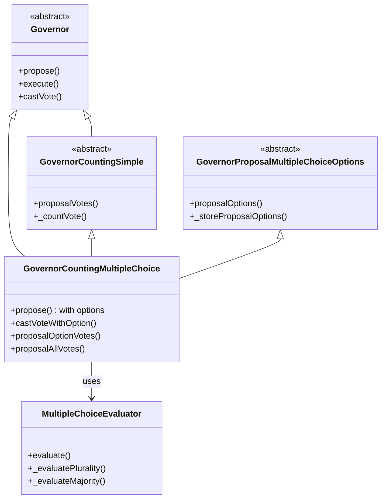
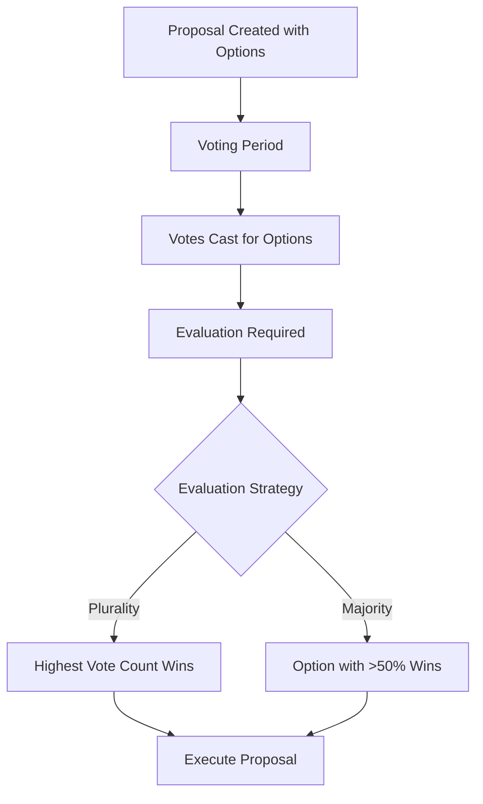

# Governor Multiple Choice

A multiple choice voting extension for OpenZeppelin's Governor contract, enabling DAOs to conduct advanced voting with flexible evaluation strategies.

## Overview

Governor Multiple Choice extends the standard OpenZeppelin Governor framework to support proposals with multiple options beyond the typical "For/Against/Abstain" voting pattern. This implementation allows governance participants to:

- Create proposals with up to 10 distinct options
- Vote for specific options rather than just approval/rejection
- Evaluate results using different strategies (Plurality or Majority)
- Maintain compatibility with all standard Governor features

## Architecture



### Evaluation Flow



## Installation

```bash
# Clone the repository
git clone https://github.com/yourusername/governor-multiple-choice.git
cd governor-multiple-choice

# Install dependencies
forge install

# Compile contracts
forge build

# Run tests
forge test
```

## Usage

### Deploying the Contracts

```solidity
// Deploy token with voting capabilities
VotesToken token = new VotesToken("GovernanceToken", "GOV");

// Deploy timelock controller
address[] memory proposers = new address[](1);
address[] memory executors = new address[](1);
executors[0] = address(0); // Allow anyone to execute
TimelockController timelock = new TimelockController(
    2 days, // Minimum delay
    proposers,
    executors,
    address(this)
);

// Deploy the governor
GovernorCountingMultipleChoice governor = new GovernorCountingMultipleChoice(
    IVotes(address(token)),
    timelock,
    "MyGovernor"
);

// Deploy the evaluator
MultipleChoiceEvaluator evaluator = new MultipleChoiceEvaluator(address(governor));

// Connect the governor and evaluator
governor.setEvaluator(address(evaluator));
evaluator.updateGovernor(address(governor));

// Set the desired evaluation strategy
evaluator.setEvaluationStrategy(MultipleChoiceEvaluator.EvaluationStrategy.Plurality);

// Grant timelock roles
timelock.grantRole(timelock.PROPOSER_ROLE(), address(governor));
timelock.grantRole(timelock.EXECUTOR_ROLE(), address(0));
timelock.revokeRole(timelock.DEFAULT_ADMIN_ROLE(), address(this));
```

### Creating a Multiple Choice Proposal

```solidity
// The target contract and function to call when the proposal passes
address[] memory targets = new address[](1);
targets[0] = address(targetContract);

uint256[] memory values = new uint256[](1);
values[0] = 0; // No ETH being sent

bytes[] memory calldatas = new bytes[](1);
calldatas[0] = abi.encodeWithSignature("functionToCall(param1,param2)", param1Value, param2Value);

string memory description = "Proposal #1: Choose a strategy for treasury allocation";

// Define the options
string[] memory options = new string[](3);
options[0] = "Allocate to Development";
options[1] = "Allocate to Marketing";
options[2] = "Keep in Treasury";

// Create the proposal
uint256 proposalId = governor.propose(targets, values, calldatas, description, options);
```

### Casting Votes

```solidity
// Standard vote (For/Against/Abstain)
governor.castVote(proposalId, 1); // 1 = For

// Vote for a specific option
governor.castVoteWithOption(proposalId, 2); // Vote for the third option (index 2)
```

### Getting Results

```solidity
// Get votes for a specific option
uint256 optionVotes = governor.proposalOptionVotes(proposalId, 1);

// Get all vote counts
uint256[] memory allVotes = governor.proposalAllVotes(proposalId);
// allVotes[0] = Against votes
// allVotes[1] = For votes
// allVotes[2] = Abstain votes
// allVotes[3] = Option 0 votes
// allVotes[4] = Option 1 votes
// allVotes[5] = Option 2 votes

// Evaluate the winning option
uint256 winningOption = evaluator.evaluate(proposalId);
```

## Evaluation Strategies

### Plurality

The option with the highest vote count wins. In case of a tie, the option with the lowest index is chosen.

### Majority

An option must receive more than 50% of the total votes cast for options to win. If no option achieves a majority, the evaluation returns `type(uint256).max`, and the proposal is effectively defeated.

## Testing

The project includes a comprehensive test suite covering:

1. Basic functionality
2. Multiple choice proposal creation and voting
3. Different evaluation strategies
4. Edge cases and security considerations
5. Integration with standard Governor functions
6. Fork tests against live contracts

Run the tests with:

```bash
forge test
```

For detailed test output:

```bash
forge test -vvv
```

## License

This project is licensed under the MIT License. 